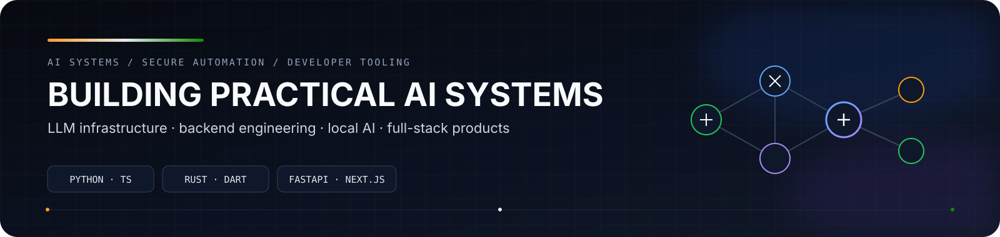
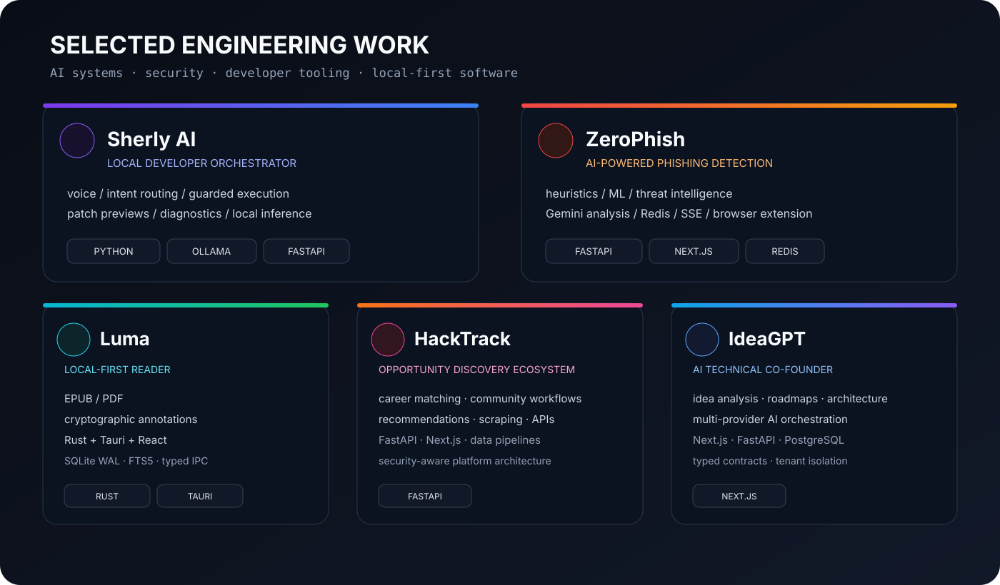

  

<h1 align="center">Sarvadnya Sonkambale</h1>

  <strong>AI Engineer • Systems Builder • Full-Stack Developer</strong>

  Building practical AI products and engineering systems across <strong>LLM infrastructure, secure automation, backend systems, and developer tooling</strong>.

  
  

---

## About

I am a Computer Engineering graduate and **B.E. Artificial Intelligence & Data Science** student focused on building software that is understandable, testable, secure, and useful.

- 🎓 B.E. Artificial Intelligence & Data Science — Class of 2028
- 📜 Diploma in Computer Engineering — **82.69%**
- 🔧 Focus: **AI/LLM systems, secure automation, developer tools, backend engineering, and systems design**

> **Build the system. Understand the system. Verify the system.**

---

## Flagship Projects

  

<table>
<tr>
<td width="50%" valign="top">

### 🤖 Sherly AI
**Voice-first local developer orchestrator**

Desktop developer copilot combining voice/text input, deterministic routing, guarded execution, diagnostics, self-healing workflows, patch previews, atomic backups, undo, and local Ollama models.

**Signal:** secure execution • deterministic routing • diagnostics • rollback workflows  
**Stack:** Python • FastAPI • WebSockets • Ollama • React/Vite • SQLite

[Repository →](https://github.com/Sarvadnya07/sherly)

</td>
<td width="50%" valign="top">

### 🛡️ ZeroPhish
**AI-powered phishing detection for Gmail**

Three-tier threat detection spanning Chrome MV3, FastAPI analysis services, and a Next.js dashboard, combining heuristics, ML/metadata checks, Gemini reasoning, and real-time SSE telemetry.

**Signal:** layered detection • threat intelligence • security controls • real-time analysis  
**Stack:** Python • FastAPI • Next.js • Gemini • Redis • Chrome MV3

[Repository →](https://github.com/Sarvadnya07/ZeroPhish)

</td>
</tr>
<tr>
<td width="50%" valign="top">

### 📖 Luma
**Local-first EPUB/PDF reader**

Rust + Tauri + React desktop reader with resilient, multi-signal annotation anchoring designed to preserve highlights and notes across document reflow.

**Signal:** Rust core • annotation integrity • SQLite WAL • FTS5 • typed IPC  
**Stack:** Rust • Tauri 2 • React • TypeScript • SQLite

[Repository →](https://github.com/Sarvadnya07/Luma)

</td>
<td width="50%" valign="top">

### 🧩 HackTrack
**Developer opportunity discovery platform**

Platform for opportunity discovery, career tracking, project collaboration, skill mapping, recommendations, community workflows, and browser-based opportunity collection.

**Signal:** platform architecture • recommendations • data pipelines • API workflows  
**Stack:** FastAPI • Next.js • PostgreSQL • scraping

[Repository →](https://github.com/Sarvadnya07/HackTrack)

</td>
</tr>
<tr>
<td colspan="2" valign="top">

### 💡 IdeaGPT
**AI technical co-founder**

AI SaaS platform for technical idea analysis, feasibility evaluation, architecture planning, roadmap generation, and technology recommendations across multiple AI providers.

**Signal:** multi-provider orchestration • isolated workspaces • architecture planning • structured outputs  
**Stack:** Next.js • FastAPI • TypeScript • PostgreSQL • Turborepo

[Repository →](https://github.com/Sarvadnya07/IdeaGPT)

</td>
</tr>
</table>

---

## Engineering Evidence

I focus on the engineering layers that make AI systems dependable in practice.

| Area | Evidence |
|---|---|
| **Architecture** | module boundaries • layered design • typed contracts • trust boundaries |
| **Security** | input validation • SSRF defenses • guarded execution • secret hygiene |
| **Quality** | regression & integration tests • failure-mode coverage • type/build checks |
| **Delivery** | CI/CD gates • linting • static analysis • security checks • reliability workflows |

---

## Core Stack

  

| Domain | Core technologies |
|---|---|
| **Languages** | Python • TypeScript • Rust • Dart • SQL |
| **AI / LLM** | LLM APIs • local inference • RAG • orchestration • evaluation |
| **Backend** | FastAPI • REST • WebSockets • SSE • PostgreSQL • Redis |
| **Frontend** | React • Next.js • Tailwind CSS • Flutter |
| **Systems** | Rust • Tauri • Linux • SQLite • Docker |
| **Engineering** | Git • GitHub Actions • testing • static analysis • CI/CD |

---

## GitHub Activity

  
  

  

---

## Current Focus

**Agentic AI** · **Secure local AI** · **Developer automation** · **Backend reliability** · **Applied ML** · **Systems engineering**

---

## Contact

**Email:** [sarvadnyasonkambale0@gmail.com](mailto:sarvadnyasonkambale0@gmail.com)  
**GitHub:** [github.com/Sarvadnya07](https://github.com/Sarvadnya07)

  <strong>Build systems that can be trusted.</strong>

