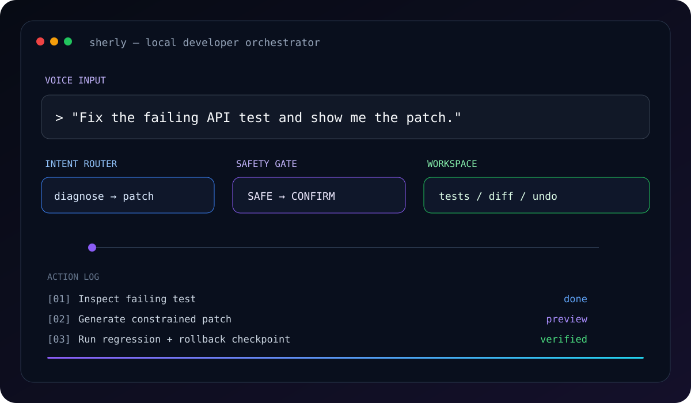
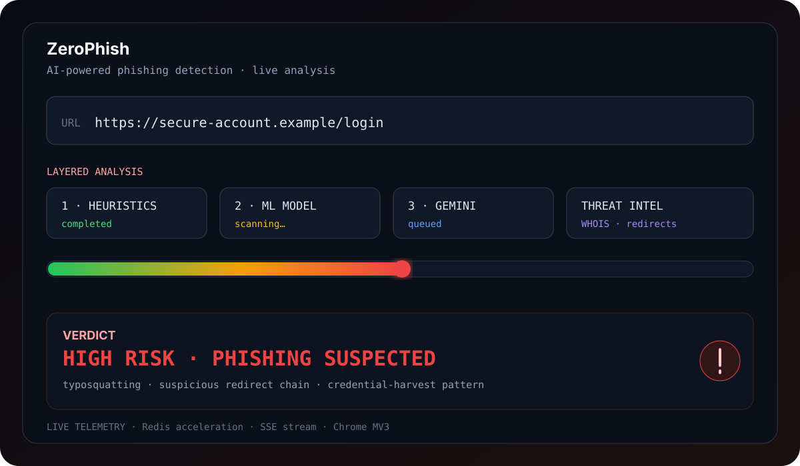

<p align="center">
  
</p>

<h1 align="center">Sarvadnya Sonkambale</h1>

<p align="center">
  <b>AI Systems Engineer • Full-Stack Builder • Linux Enthusiast</b>
</p>

<p align="center">
  <i>Building practical AI systems with explicit architecture, secure execution boundaries, and verifiable engineering.</i>
</p>

<p align="center">
  <a href="mailto:sarvadnyasonkambale0@gmail.com"></a>
  <a href="https://github.com/Sarvadnya07"></a>
</p>

---

## 🧠 About Me

I build software at the intersection of **AI, application engineering, security, and systems design**.

- 🎓 **B.E. Artificial Intelligence & Data Science** — Class of 2028
- 📜 **Diploma in Computer Engineering** — **82.69%**
- 🧩 Interested in **LLM orchestration, developer tooling, secure automation, backend systems, and local-first software**
- 🛠️ Daily tools include **Python, TypeScript, Rust, Dart, SQL, Linux, APIs, databases, and CI/CD**

> **AI is the engine. Architecture is the chassis. Verification keeps the system honest.**

---

## ⚙️ Engineering Focus

| 🤖 AI Systems | 🛡️ Security | 🏗️ Systems | 🚀 Delivery |
|---|---|---|---|
| LLM orchestration | Threat-aware boundaries | Rust / Tauri | CI/CD |
| RAG & context pipelines | Input validation | Linux | Testing |
| Local inference | Sandboxing | SQLite / PostgreSQL | Static analysis |
| Agent workflows | Secret hygiene | Process execution | Observability |

### Principles

**Security by default** · **Deterministic routing where possible** · **Tests as contracts** · **Evidence over hype** · **Explicit architecture boundaries**

---

## 🚀 Featured Engineering Work

<p align="center">
  
</p>

### 🤖 Sherly AI
**Voice-first local developer orchestrator**

<p align="center">
  
</p>

Natural-language developer workflows with deterministic intent routing, guarded command execution, diagnostics, patch previews, atomic file operations, local model orchestration, and persistent action history.

**Stack:** Python • FastAPI • Ollama • PySide6

[View repository →](https://github.com/Sarvadnya07/sherly)

### 🛡️ ZeroPhish
**AI-powered phishing detection and threat-forensics platform**

<p align="center">
  
</p>

Multi-stage email and URL analysis combining browser heuristics, ML, threat intelligence, Gemini reasoning, Redis acceleration, SSE telemetry, SSRF defenses, and a Chrome MV3 extension.

**Stack:** Python • FastAPI • Next.js • Gemini • Redis

[View repository →](https://github.com/Sarvadnya07/ZeroPhish)

### 📖 Luma
**Local-first EPUB/PDF reader with resilient annotations**

Rust + Tauri + React application focused on durable annotations, local storage, search, typed IPC, and a capability-aware desktop boundary.

**Stack:** Rust • Tauri 2 • React • TypeScript • SQLite

[View repository →](https://github.com/Sarvadnya07/Luma)

### 🧩 HackTrack
**Developer opportunity discovery ecosystem**

A modular platform combining opportunity discovery, career matching, community workflows, recommendations, scraping, APIs, and infrastructure components.

**Stack:** FastAPI • Next.js • PostgreSQL • data pipelines

[View repository →](https://github.com/Sarvadnya07/HackTrack)

### 💡 IdeaGPT
**AI technical co-founder for turning ideas into engineering plans**

A full-stack platform for idea analysis, architecture blueprints, technology recommendations, roadmaps, and structured technical outputs across multiple AI providers.

**Stack:** Next.js • FastAPI • PostgreSQL • multi-provider LLMs

[View repository →](https://github.com/Sarvadnya07/IdeaGPT)

---

## 🧰 Tech Stack

<p align="center">
  
</p>

<p align="center">
  
  
  
  
</p>

---

## 📊 GitHub Overview

<p align="center">
  
  
</p>

<p align="center">
  
</p>

<p align="center">
  
</p>

---

## 🧭 How I Build

```text
Problem
   ↓
System model
   ↓
Architecture + trust boundaries
   ↓
Implementation
   ↓
Tests + static analysis
   ↓
CI/CD verification
   ↓
Observe + benchmark
   ↓
Document trade-offs + debt
```

I prefer **small, verifiable increments** over large rewrites and aim to leave systems easier to understand, secure, test, and maintain.

---

## 🎯 Current Direction

**Agentic AI** · **Secure local AI** · **Developer automation** · **Backend reliability** · **Applied ML** · **Systems engineering**

## 🤝 Open To

**AI Engineering Internships • Full-Stack AI Development • Developer Tools • Systems & Security Projects • Open Source Collaboration**

---

<p align="center">
  <b>Build systems that can be trusted.</b>
</p>
